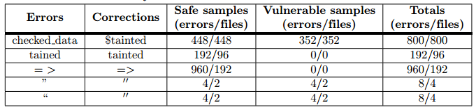
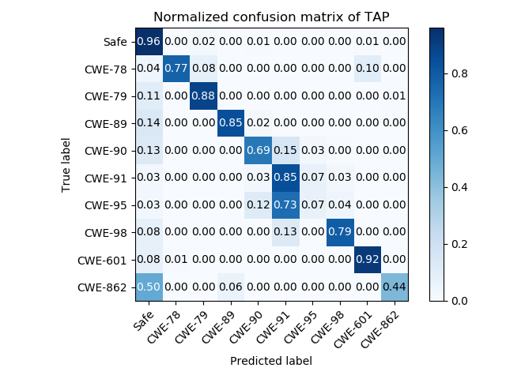

# TAP

## Research paper

We present the findings of this work in the following research paper:

**TAP: A static analysis model for PHP vulnerabilities based on token and deep learning technology**
Yong Fang,Shengjun Han,Cheng Huang ,Runpu Wu
Published: November 18, 2019
[View](https://doi.org/10.1371/journal.pone.0225196)

## Introduction

With the widespread usage of Web applications, the security issues of source code are increasing. The exposed vulnerabilities seriously endanger the interests of service providers and customers. There are some models for solving this problem. However, most of them rely on complex graphs generated from source code or regex patterns based on expert experience. In this paper, TAP, which is based on token mechanism and deep learning technology, was proposed as an analysis model to discover the vulnerabilities of PHP: Hypertext Preprocessor (PHP) Web programs conveniently and easily. Based on the token mechanism of PHP language, a custom tokenizer was designed, and it unifies tokens, supports some features of PHP and optimizes the parsing. Besides, the tokenizer also implements parameter iteration to achieve data flow analysis. On the Software Assurance Reference Dataset(SARD) and SQLI-LABS dataset, we trained the deep learning model of TAP by combining the word2vec model with Long Short-Term Memory (LSTM) network algorithm. According to the experiment on the dataset of CWE-89, TAP not only achieves the 0.9941 Area Under the Curve(AUC), which is better than other models, but also achieves the highest accuracy: 0.9787. Further, compared with RIPS, TAP shows much better in multiclass classification with 0.8319 Kappa and 0.0840 hamming distance.


## Reference

If you use TAP in a scientific publication, we would appreciate citations using this Bibtex entry:

```
@article{fang2019tap,
  title={TAP: A static analysis model for PHP vulnerabilities based on token and deep learning technology},
  author={Fang, Yong and Han, Shengjun and Huang, Cheng and Wu, Runpu},
  journal={PloS one},
  volume={14},
  number={11},
  year={2019},
  publisher={Public Library of Science}
}
```

# TAP Demo

TAP: A Static Analysis Model for PHP Vulnerabilities Based on Token and Deep Learning Technology


Data download from
```
https://samate.nist.gov/SARD/index.php
```

Unzip 
```
SARD-testsuite-103.zip
```
 
Classify samples.
```
python classify.py
```

Correct some errors of SARD manually. 
 

Get tokens by our tokenizer.
```
php Tokenizer.php
```

Run TAP.
```
python tap.py
```

Evaluation.
```
python confusion_matrix.py
```

Result.

